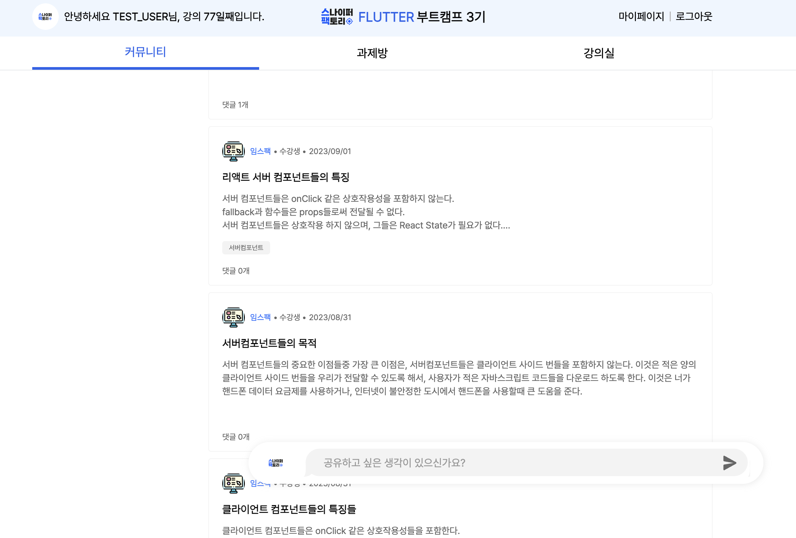
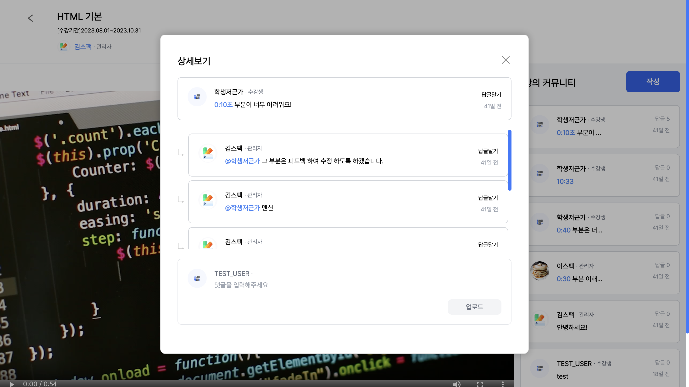

# 스나이퍼팩토리 학습관리시스템(LMS)
[배포링크](https://sfac-lms-team-b.vercel.app/)\
스나이퍼팩토리의 학습관리시스템은 스나이퍼팩토리에서 부트캠프를 개설할 때마다 이용할 수 있게 만들었습니다.
수강생 간의 커뮤니티, 강의내에서의 쌍방향 소통이 기존 학습관리시스템과의 가장 큰 차별점입니다.


## 목차
0. [사용방법](사용방법)
1. [설치](#설치)
2. [기능 및 개요](#기능-및-개요)
3. [기여방법](#기여방법)

## 사용방법
배포된 링크에 접속하여 아래의 아이디와 비밀번호를 통해 접속을 하면 됩니다.\
**이메일 로그인 테스트 계정**
|     | 관리자        | 수강생         |
| --- | ------------- | -------------- |
| ID  | test@test.com | test@naver.com |
| PW  | test1234      | 123123         |

## 설치
스나이퍼팩토리 학습관리스템은 Typescript(v5.2)와 TailwindCSS(v3.3.3) Next js 13 버전을 활용해서 제작이 되었습니다.\
현재 레포지토리를 만들고 싶은 파일에 클론 코딩을 하면 됩니다.
```
git clone https://github.com/leeyulgok/sfac-lms-team-b.git
```
또한 자체적으로 라이브러리를 제작했기 때문에 npm 파일 또한 설치를 해주시면 됩니다.
```
npm i sfac-designkit-react
```
마지막으로 스나이퍼팩토리의 Firebase를 사용하여 구축을 했기 때문에 활용하고 싶다면,
따로 Firebase의 Firestore를 구축해서 사용하면 됩니다.

## 기능 및 개요
스나이퍼팩토리의 학습관리시스템의 핵심은 소통입니다. 일반적으로 관리자나 강사가 제공하여 수강생이 수강만 하는 것이 아닙니다.
수강생은 언제든지 강의에 궁금한 점이 있으면 강의에 댓글을 남길 수 있습니다. 또한 수강생들은 커뮤니티를 구성하기 더 나은 학습 분위기를 조성하고 서로 선의의 경쟁을 할 수 있는 환경을 마련해줍니다.



## 기여방법
이번 프로젝트에서 강의장 페이지와 DB 설계를 담당했습니다.

> https://app.eraser.io/workspace/kGgQYva1zAO0XZUtDvDc

DB 설계는 프로젝트를 구성하는 팀의 한 명씩 담당했으며 eraser.io로 설계했습니다.


강의장 페이지는 수강생이 강의를 수강할 수 있는 페이지로 총 4가지로 나뉩니다.
> 1. 강의장 헤더 - 강의의 기본적인 정보
> 2. 강의내용 - 영상 제공(ReactPlayer 사용)
> 3. 강의장 네비게이션 - 이전, 다음 강의 이동
> 4. 강의 커뮤니티 - 강의에 대한 댓글 등록



## 마무리

스나이퍼팩토리의 학습관리시스템 프로젝트는 설계부터 시작한 프로젝트입니다. 기획은 사전에 준비된 부분이 있었지만 부족한 부분이 많아 개발자끼리 끊임없이 소통하면서
기존의 기획보다 더 나은 결과로 도출할 수 있었습니다. 4주 간 함께한 모든 팀에게 감사합니다.


